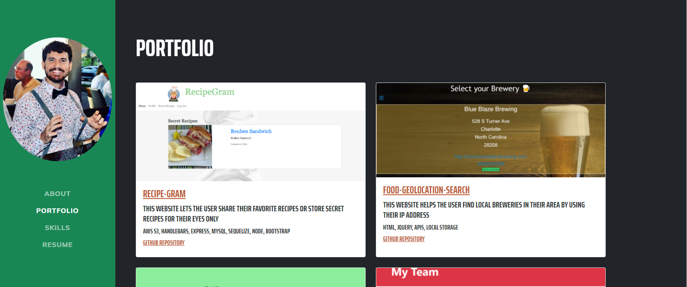

# portfolio-updated

- [portfolio-updated](#portfolio-updated)
  - [Description](#description)
  - [Review Links](#review-links)
  - [Questions](#questions)
  - [Screenshots](#screenshots)
  - [License](#license)

## Description
This is my updated Portfolio page.  This update includes project 2 website and an updated resume.  I also used bootstrap to improve the layout and overall look. This page now showcases my work while also being a demonstration of how I have improved as a coder since starting this Bootcamp.

## Review Links
[Repository](https://github.com/Twdavis85/portfolio-updated) &nbsp; | &nbsp; 
[Live](https://twdavis85.github.io/portfolio-updated/)

## Questions
To check out my work and follow me on GitHub visit: [Twdavis85](https://github.com/Twdavis85)  
If you have any questions about this or any other project feel free to email me at: [tdnc85@yahoo.com](mailto:tdnc85@yahoo.com)

## Screenshots

## License
Copyright 2021 &ensp; Tyler Davis

    Permission is hereby granted, free of charge, to any person obtaining
    a copy of this software and associated documentation files (the "Software"),
    to deal in the Software without restriction, including without limitation
    the rights to use, copy, modify, merge, publish, distribute, sublicense,
    and/or sell copies of the Software, and to permit persons to whom the
    Software is furnished to do so, subject to the following conditions:
    
    The above copyright notice and this permission notice shall be included
    in all copies or substantial portions of the Software.
    
    THE SOFTWARE IS PROVIDED "AS IS", WITHOUT WARRANTY OF ANY KIND, 
    EXPRESS OR IMPLIED, INCLUDING BUT NOT LIMITED TO THE WARRANTIES 
    OF MERCHANTABILITY, FITNESS FOR A PARTICULAR PURPOSE AND NONINFRINGEMENT. 
    IN NO EVENT SHALL THE AUTHORS OR COPYRIGHT HOLDERS BE LIABLE FOR ANY 
    CLAIM, DAMAGES OR OTHER LIABILITY, WHETHER IN AN ACTION OF CONTRACT, 
    TORT OR OTHERWISE, ARISING FROM, OUT OF OR IN CONNECTION WITH THE SOFTWARE 
    OR THE USE OR OTHER DEALINGS IN THE SOFTWARE.